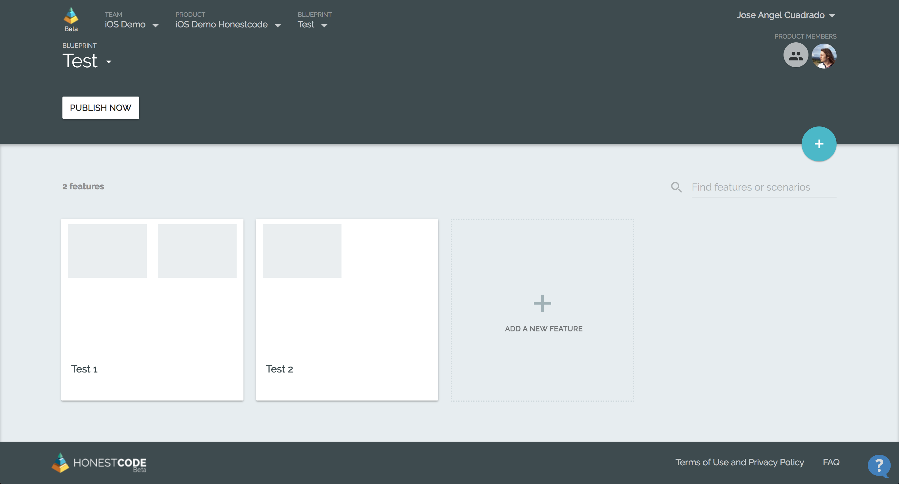
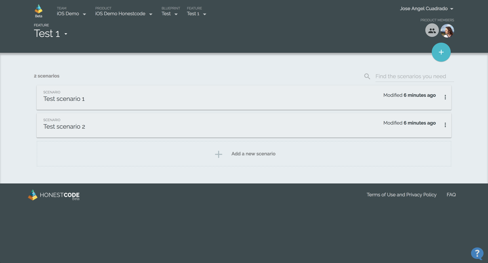
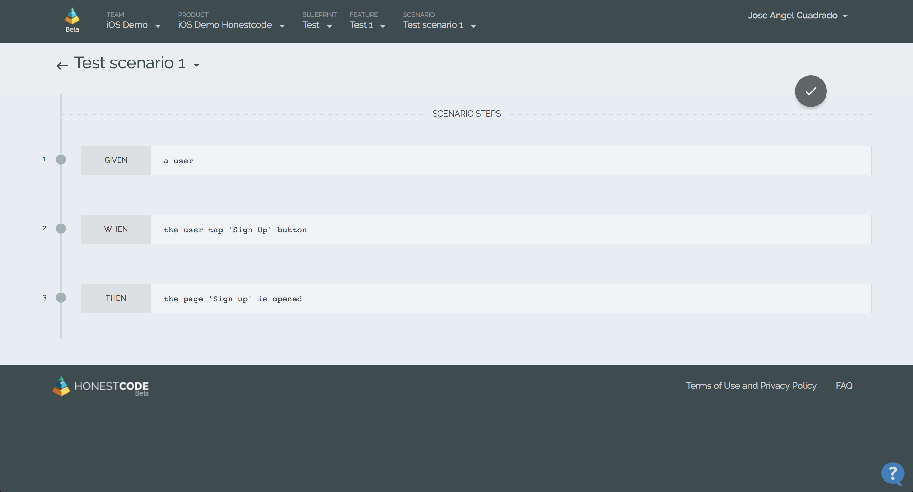
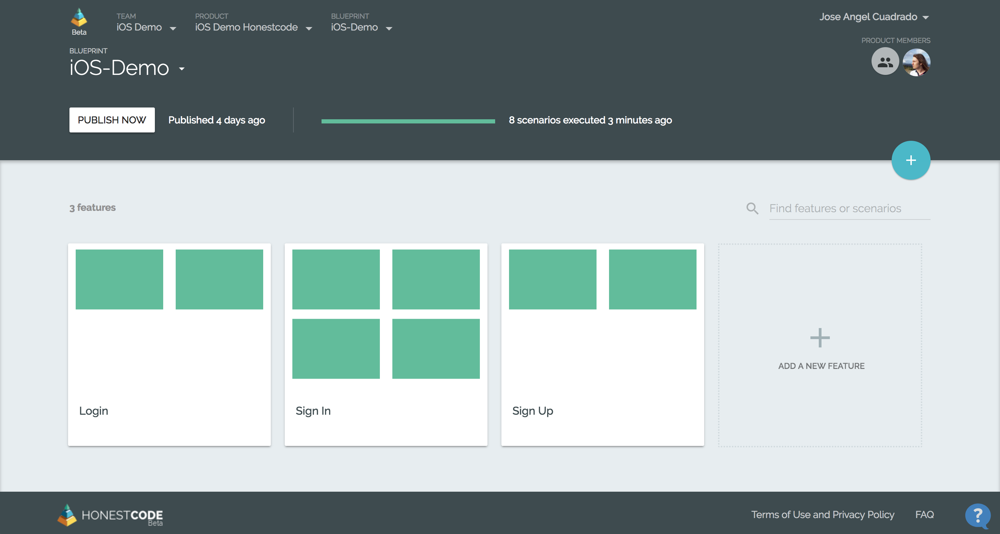

# iOS-Demo

This repository contains a basic iOS project connected to Honestcode services. This sample code is intended to show how integrate the Gherkin acceptance tests generated by Honestcode in an iOS project, how to run them, and upload the results to the Honestcode platform to show it graphically.

## Requisites

* Xcode
* [Cucumberish](https://github.com/Ahmed-Ali/Cucumberish)
* iOS project with UI Tests target configured
* Honestcode project configured

## Steps to integrate Honestcode

1. With the iOS project with UI Tests target configured and Cucumberish added to the project (through CocoaPods, Carthage or manually), the user will generate a blueprint with the features and scenarios needed.
2. Once the features have been written, these can be added to the repository through "Publish now" button ubicated in the blueprint panel.
3. To add these files to the iOS project, it is necessary follow the Cucumberish guide corresponding to the project configuration. Cucumberish allows read Gherkin features and match the sentences with the tests coded. This is a resume of the main steps to connect the files with our code:
	1. Locate files added by Honestcode in you project, drag them to the project and drop them in the UI Test target. When Xcode shows the screen to choose options for adding the files, don't select the option "Copy items if needed".
	2. Create an initializer class with the next code. This code includes the app initialization and its launch before each scenario. If the developer needs configure any kind of behaviour (for example, different kind of users), can add parameters in this point and set the initial state of the app. After this, it's necessary to init the steps of the tests. Finally, the code call Cucumberish to execute the features in the path indicated.

	```Swift
	import Foundation
	import Cucumberish

	class CucumberishInitializer: NSObject {

	    class func CucumberishSwiftInit() {
	        self.defineMainStep()
	        self.initSteppers()
	        
	        let bundle = Bundle(for: CucumberishInitializer.self)
	        
	        // Tell Cucumberish the name of your features folder and let it execute them for you...
	        Cucumberish.executeFeatures(inDirectory: ".", from: bundle, includeTags: nil, excludeTags: nil)
	    }
	 
	    class func defineMainStep() {
	        var application : XCUIApplication!
	        
	        beforeStart { () -> Void in
	            application = XCUIApplication()
	        }
	        
	        afterFinish {
	            
	        }
	        
	        before { (scenario) in
	            
	            /*
	             *  You can add parameters to set initial state of the app through "launchEnvironment"
	             *  and "launchArguments" variables of XCUIApplication. Use these variables in
	             *  appDelegate. This step is repeated before each scene.
	             */
	            application.launch()
	        }
	    }
	    
	    class func initSteppers() {
	        Login().defineSteps()
	        SignIn().defineSteps()
	        SignUp().defineSteps()
	    }
	}
	```

	This is an example of one of the steppers:

	```Swift
	import UIKit
	import Cucumberish

	class Login: NSObject {

	    func defineSteps() {

	        /*  Scenario: Navigate to Sign up  */
	        
	        Given("a user") { (args, userInfo) in
	            
	        }
	        
	        When("the user tap 'Sign Up' button") { (args, userInfo) in
	            LoginScreen.tapSignUpButton()
	        }
	        
	        Then("the page 'Sign Up' is opened") { (args, userInfo) in
	            SignUpScreen.screenExists()
	        }
	        
	    }
	}
	```

	3. Cucumberish is a framework written in Objective-C, so if the project is written in Swift, you must add this .m file calling to Swift initializer. When the file is created, Xcode shows an alert asking about configure an Objective-C bridging header that the developer must create.

	```Objective-C
	#import "Demo_HonestcodeUITests-Swift.h"

	__attribute__((constructor))
	void CucumberishInit()
	{
	    [CucumberishInitializer CucumberishSwiftInit];
	}
	```

4. Once all tests are written, you can check the results with CMD+U or selecting the test classes which must be tested from "Test navigator". Because a [known issue](https://github.com/Ahmed-Ali/Cucumberish#known-issues) of Cucumberish, if the developer doesn't test all tests cases, the rest of the scenarios will disappear, and don't appear until the developer tests all the cases with the command CMD+U.
5. Finally, when the tests are completed, it is generated a report that must be uploaded to Honestcode platform. The developer can use the next commands to upload it (the commands can be used from terminal or through a script), where $1 is the project name, and $2 is the identifier of the blueprint to which the tests belong (visible in the blueprint configuration). 

	```
	HONESTCODE_JSON="$(find ~/Library/Developer/CoreSimulator/Devices/*/data/Containers/Data/Application/*/Documents/CucumberishTestResults-$1UITests.json)" 

	curl -X POST -H "Content-Type: application/json; charset=UTF-8" --data-binary @$HONESTCODE_JSON https://pro.honestcode.io/api/hooks/tr/$2 -v -s > /dev/null
	```

## Use

This project is ready to be used by anyone. On the one hand, the project has a simple UI with four views through you can navigate. On the other hand, in the UI tests folder there are Honestcode features, Cucumberish initialization code, steppers (files which match features and code) and files which include testing over application. You can run the project to check the app functionality, or run the tests as we described before and check the result of the acceptance tests created in Honestcode.

### Honestcode

In the next pictures, you can see the feature creation process through [Honestcode](https://pro.honestcode.io) platform. It's very easy!







Finally, after upload the results of the tests, you can see graphically the results in the different panels. This is an example of the results in the features panel:


